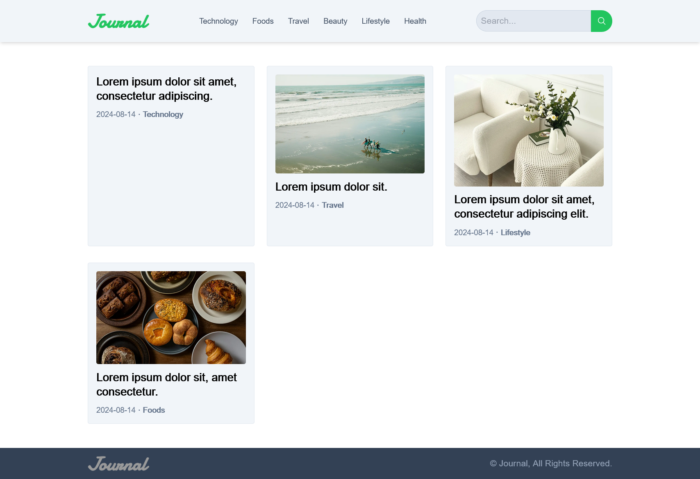
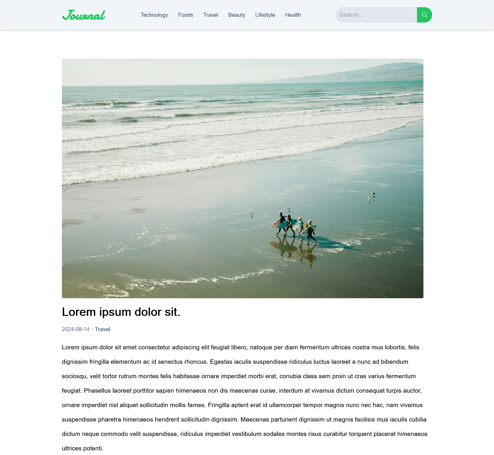
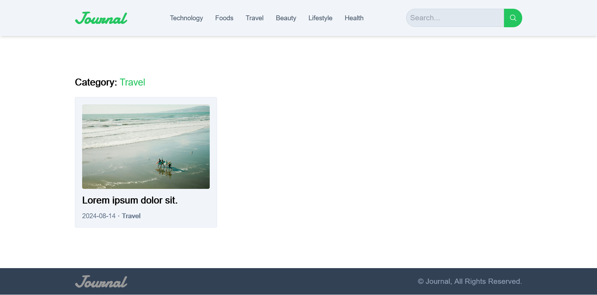

# Journal - Front-End

## Setup [<u>Back-End</u>](https://github.com/shuvo-devs/Journal-Back-End-Django-Rest) First.

A blog made with Django Rest (Back-End) and NextJS (Front-End)

| Previews                                                                                          |
| ------------------------------------------------------------------------------------------------- |
| *Homepage*<br/>                             |
| *Single Post Page*<br/> |
| *Posts by Category Page*<br/>               |

---

## Requirements

- npm >= 10.7.0

- node >= 20.12.2

---

## Environment Variables

You will need to create and add the following environment variable to your `.env` file.

```bash
NEXT_PUBLIC_BASE_URL = YOUR_BACKEND_BASE_URL
```

---

## Installation

- Open `cmd` or `bash` in the project directory.

```bash
npm install
```

## Run Locally

```bash
npm run dev
```

You can access the website at http://localhost:3000 and the admin panel at http://127.0.0.1:8000/admin

---

## License

[MIT](https://choosealicense.com/licenses/mit/)
